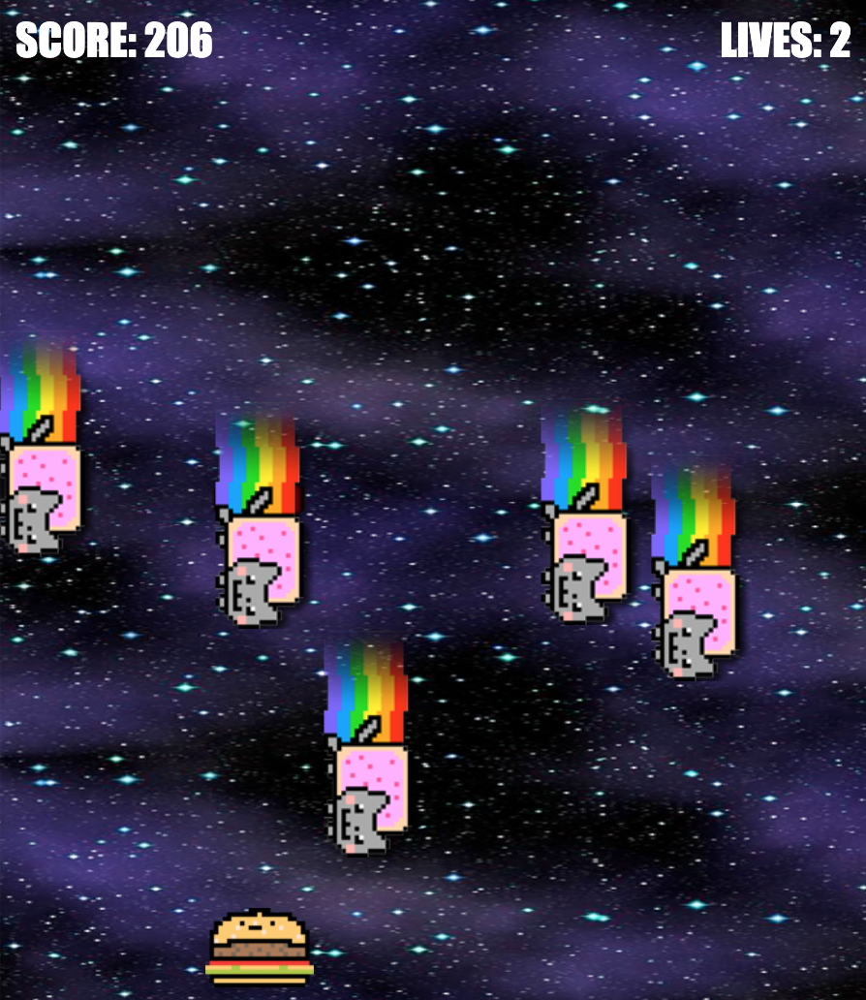

# Object Oriented Programming Game Project

## The game

This game is called **I CAN HAZ CHEEZBURGER?!??**. In the game, you play as an anthropomorphic cheeseburger. The only thing you can do is move left or right with the arrows of your keyboard.

The goal of the game is to stay alive as long as possible by avoiding the Nyan Cats who are raining from the sky and trying to _haz_ you. The longer you stay alive, the higher your score!

## Game Improvements

- Increased the size of the gameboard.
- Added more Nyan Cat enemies
- Added a restart button at the end of the game.
- Added a Nyan Cat sound track (suggestion to keep your volume low!)
- Added a point system
- Added lives (up to 3 max)
- Added hearts on the game board to be able to gain lives 

Give it a shot here: https://gallant-turing-09290e.netlify.app

